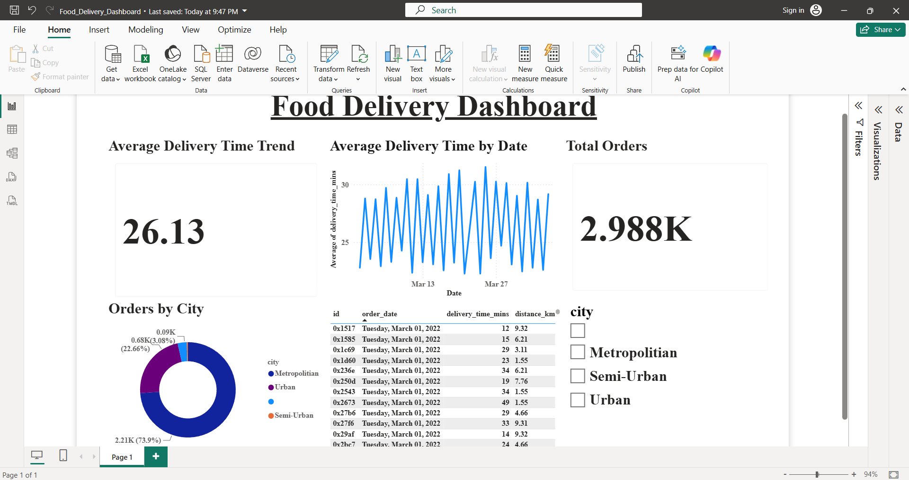

# 🍔 Food Delivery Dashboard

An interactive **Power BI Dashboard** built to analyze food delivery performance using key business metrics such as delivery time, order trends, and city-wise order distribution.

---

# 📌 Project Overview

This project demonstrates how Power BI can transform raw food delivery data into meaningful business insights through interactive visualizations.

The dashboard helps analyze:

- 📦 Total Orders
- ⏱️ Average Delivery Time
- 📈 Delivery Time Trend by Date
- 🌍 Orders by City
- 🔍 Interactive Filtering by City
- 📋 Order-Level Details

This project was created as part of my learning journey in **Data Analytics** and **Business Intelligence**.

---

# 📊 Dashboard Preview

> Replace the image below with your dashboard screenshot.



---

# 📈 Dashboard Features

### ✅ KPI Cards

- Average Delivery Time
- Total Orders

### ✅ Line Chart

- Average Delivery Time by Date

### ✅ Donut Chart

- Orders by City

### ✅ Table

Displays

- Order ID
- Order Date
- Delivery Time
- Distance
- City

### ✅ Slicer

Filter the dashboard by City.

---

# 📂 Dataset

The dataset contains food delivery order information including:

- Order ID
- Order Date
- Delivery Time
- Distance
- City
- Delivery Person Details
- Customer Details
- Weather
- Festival
- Traffic Conditions

---

# 🛠️ Tools Used

- Microsoft Power BI Desktop
- Power Query
- DAX
- Data Modeling
- Data Visualization

---

# 📌 Key Insights

- Average delivery time is approximately **26 minutes**.
- Most orders come from Metropolitan areas.
- Delivery time changes across different dates.
- Interactive filters allow quick city-wise analysis.

---

# 📁 Files Included

| File | Description |
|------|-------------|
| Food_Delivery_Dashboard.pbix | Power BI Project |
| Food_Delivery_Dashboard.pdf | Dashboard PDF |
| dashboard.png | Dashboard Screenshot |
| README.md | Project Documentation |

---

# 🚀 How to Use

1. Clone this repository

```
git clone https://github.com/Jeelanimohammad/Food-Delivery-Dashboard.git
```

2. Open

```
Food_Delivery_Dashboard.pbix
```

using **Microsoft Power BI Desktop**.

3. Interact with filters and visuals to explore the dashboard.

---

# 📚 Skills Demonstrated

- Data Cleaning
- Data Visualization
- Dashboard Design
- Business Intelligence
- Power BI
- Power Query
- DAX
- Data Analysis

---

# 🎯 Future Improvements

- Add more KPIs
- Include Delivery Success Rate
- Add Customer Satisfaction Analysis
- Create Mobile Dashboard Layout
- Publish Dashboard to Power BI Service

---

# 👨‍💻 Author

**Mohammad Jeelani**

🎓 B.Tech CSE (Data Science)

GitHub:
https://github.com/Jeelanimohammad

---

## ⭐ If you found this project useful, don't forget to Star this repository!
